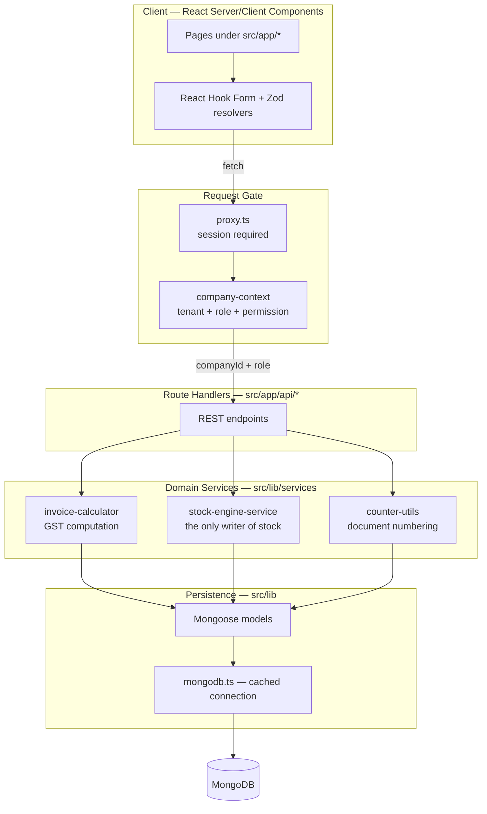
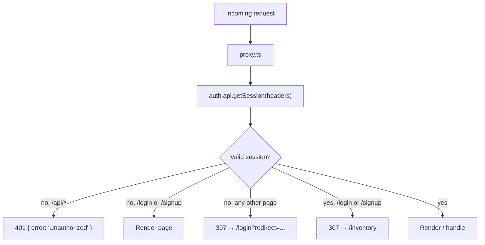
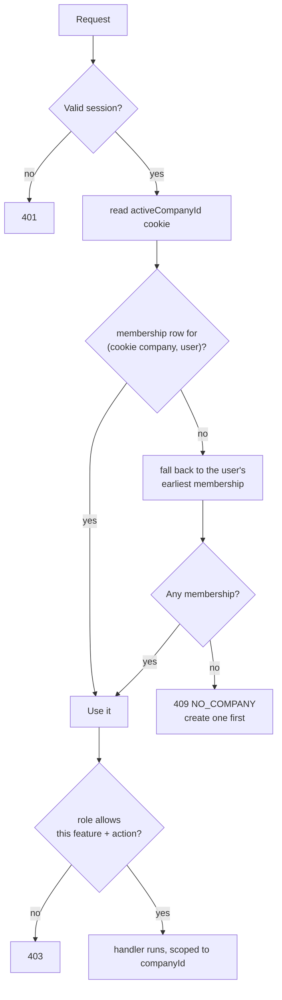

# Invoice & Inventory Management System

A GST-compliant billing and stock management application for Indian businesses. Handles sales
invoicing, purchase bills, multi-godown inventory, credit/debit notes, and a full immutable stock
ledger.

Multi-company: one account can keep the books for several businesses, each with its own document
numbering, its own team, and its own export file. Access is role-based, from full owner down to a
read-only guest.

Built with Next.js 16 (App Router), MongoDB via Mongoose, and TypeScript.

---

## Table of Contents

- [Quick Start](#quick-start)
- [Tech Stack](#tech-stack)
- [Architecture](#architecture)
- [Authentication](#authentication)
- [Companies & Tenancy](#companies--tenancy)
- [Roles & Permissions](#roles--permissions)
- [Invitations & Guest Access](#invitations--guest-access)
- [Export & Import](#export--import)
- [Scale: Pagination & Search](#scale-pagination--search)
- [Directory Layout](#directory-layout)
- [Data Model](#data-model)
- [Core Business Flows](#core-business-flows)
- [The Stock Engine](#the-stock-engine)
- [The GST Tax Engine](#the-gst-tax-engine)
- [Document Numbering](#document-numbering)
- [Invoice Output: Print & PDF](#invoice-output-print--pdf)
- [API Reference](#api-reference)
- [Application Routes](#application-routes)
- [Validation](#validation)
- [Known Issues & Gotchas](#known-issues--gotchas)

---

## Quick Start

**Prerequisites:** Node.js 20+, a running MongoDB instance (local or Atlas).

```bash
npm install
```

Create `.env.local` from the template:

```bash
cp .env.example .env.local
```

| Variable | Purpose | Default |
|---|---|---|
| `MONGODB_URI` | MongoDB connection string | `mongodb://localhost:27017/invoice-db` |
| `NEXT_PUBLIC_APP_URL` | Public base URL (client-visible) | `http://localhost:3000` |
| `BETTER_AUTH_SECRET` | Session encryption key — **required in production** | none |
| `BETTER_AUTH_URL` | Base URL Better Auth issues cookies for | `http://localhost:3000` |
| `MONGODB_TRANSACTIONS` | `true` only on a replica set / Atlas — see below | `false` |

Generate the auth secret with:

```bash
openssl rand -base64 32
```

Then:

```bash
npm run dev
```

Open <http://localhost:3000>. You'll be redirected to `/login` — create an account at `/signup`
first, then create your first company. A company has to exist before any business screen works: it
supplies the home state the GST engine compares against, and it is the tenancy key every document is
filed under.

### Upgrading an existing database

If you have data from before multi-company, run the migration once. It stamps every document with a
`companyId`, makes the existing user the owner, and replaces the old globally-unique document-number
indexes with per-company ones.

```bash
node scripts/migrate-multi-company.mjs
```

It reports without changing anything. Re-run with `--apply` to migrate, then restart the dev server
so Mongoose rebuilds its indexes. The script is idempotent — each step skips work already done.

> **`MONGODB_TRANSACTIONS`**: a standalone `mongod` rejects transactions outright
> (`Transaction numbers are only allowed on a replica set member or mongos`), which breaks sign-up.
> It defaults to `false` so any deployment works. Set it to `true` on a replica set or Atlas to make
> Better Auth's multi-step writes atomic.

### Scripts

| Command | What it does |
|---|---|
| `npm run dev` | Development server (Turbopack) |
| `npm run build` | Production build — compiles, then type-checks |
| `npm start` | Serve the production build |
| `npm run lint` | ESLint across the project |
| `npm run type-check` | `tsc --noEmit` with a raised heap limit |

> Both `build` and `type-check` run under `--max-old-space-size=4096`. This is deliberate — see
> [Known Issues](#known-issues--gotchas).

---

## Tech Stack

| Layer | Choice |
|---|---|
| Framework | Next.js 16.2 (App Router, Turbopack) |
| UI | React 19, Tailwind CSS 4, Radix UI primitives |
| Forms | React Hook Form + Zod (via `@hookform/resolvers`) |
| Auth | Better Auth 1.6 (email + password, cookie sessions) |
| Database | MongoDB + Mongoose 9 |
| Validation | Zod 3 |
| Charts | Recharts |
| PDF export | jsPDF (vector text, no rasterisation) |
| Notifications | react-hot-toast |
| Icons | lucide-react |

---

## Architecture

A four-layer server design. Every write that touches stock is funnelled through a single service so
the ledger can never drift from item balances.



**Design rules the codebase follows:**

1. **Route handlers are thin.** They parse the request, call a domain service, and shape the
   response. Business arithmetic lives in `src/lib/services`.
2. **`processStockMovement` is the single choke point for stock.** No route mutates `item.stock`
   directly. Every movement simultaneously updates the item balance and appends a ledger row.
3. **The stock ledger is append-only during normal operation.** Rows are deleted only by an explicit
   cancellation via `revertStockMovement`.
4. **The connection is cached on `globalThis`.** `src/lib/mongodb.ts` memoises the Mongoose
   connection so Next.js hot reloads and serverless invocations reuse one pool instead of leaking
   connections.
5. **No handler reaches the database without a tenant and a permission.** Business routes call
   `requirePermission(req, feature, action)`, which resolves the active company, re-checks
   membership, and enforces the role — there is no code path that yields a `companyId` without
   having stated what it needs it for.
6. **Lists are paginated at the source.** Endpoints return a cursor envelope rather than a
   collection, so response size is bounded regardless of how much data a company holds.

---

## Authentication

Email + password sign-in via [Better Auth](https://better-auth.com), with httpOnly cookie sessions.
The whole application is gated — there is no anonymous access to any page or API route.

### Pieces

| File | Role |
|---|---|
| [`src/lib/auth.ts`](src/lib/auth.ts) | Server config — adapter, password rules, session lifetime |
| [`src/lib/auth-client.ts`](src/lib/auth-client.ts) | Browser client — `signIn`, `signUp`, `signOut`, `useSession` |
| [`src/app/api/auth/[...all]/route.ts`](src/app/api/auth/[...all]/route.ts) | Mounts every Better Auth endpoint |
| [`src/proxy.ts`](src/proxy.ts) | The gate — validates the session on every request |
| [`src/app/login`](src/app/login/page.tsx) · [`src/app/signup`](src/app/signup/page.tsx) | The two screens |
| [`src/components/layout/AppShell.tsx`](src/components/layout/AppShell.tsx) | Renders auth screens without the app nav chrome |

Better Auth stores its own `user`, `session`, and `account` collections alongside the business
collections. It opens its own `MongoClient` because it needs a raw MongoDB `Db`, not a Mongoose
connection; the client is cached on `globalThis` so hot reloads reuse one pool.

Sessions last 7 days and refresh their expiry once a day. Minimum password length is 8.

### How the gate works



Three things worth knowing:

1. **It validates the session, it does not merely check for a cookie.** A forged
   `better-auth.session_token` value is rejected — verified. The cheaper cookie-presence check
   (`getSessionCookie`) would have accepted it, which is why it is not used here.
2. **`proxy.ts`, not `middleware.ts`.** Next.js 16 renamed the convention. `proxy` always runs on the
   Node.js runtime, which is what makes the MongoDB session lookup possible — and it also means a
   `runtime` key in the `config` export is rejected at build time.
3. **API routes get a 401, pages get a redirect.** The matcher excludes `/api/auth/*` so sign-in and
   sign-up stay reachable while signed out.

The gate covers session validity in one place; **authorisation is separate and lives in every
handler** via `requirePermission` (see [Roles & Permissions](#roles--permissions)). Narrowing the
proxy matcher would expose routes to unauthenticated callers, but it would not bypass the tenant or
role checks.

`/invite/*` and `/api/invites/*` are the only routes open either way: an invitee must be able to read
what they were offered before signing in, and an already-signed-in user must be able to accept
rather than being bounced to the dashboard.

### CSRF

Better Auth rejects cross-origin state-changing requests with `403 MISSING_OR_NULL_ORIGIN`. Verified:
a sign-out sent with `Origin: https://evil.example` and a valid session cookie is refused and the
session survives. Requests with no `Origin` header at all are also refused — which is why `curl`
testing of these endpoints needs `-H "Origin: http://localhost:3000"`.


---

## Companies & Tenancy

Every business document carries a `companyId`, and every query filters on it. One account can hold
several companies; each keeps its own items, parties, documents, numbering and team.

### How the active company is resolved

[`src/lib/company-context.ts`](src/lib/company-context.ts) runs on every business request:



**The cookie selects; membership authorises.** The cookie is only a hint about which company you
meant — it grants nothing. Membership is re-read from the database on every request, so revoking
someone takes effect immediately, and editing the cookie to another company's id simply falls back
to your own. Verified: a guest sending a forged `activeCompanyId` for a company they do not belong to
resolved back to their own company.

### Per-company document numbering

Counters are keyed on `(companyId, name)`, so each company runs its own `INV-001`, `PUR-001` series
rather than sharing one global run. The unique indexes on `invoiceNumber`, `purchaseInvoiceNumber`,
`adjustmentNo` and `transferNo` are compound with `companyId` for the same reason — a global unique
index would reject the second company's `INV-001`.

---

## Roles & Permissions

Five roles, defined once in [`src/lib/permissions.ts`](src/lib/permissions.ts) as a feature × access
matrix. The API and the UI read the same table, so the interface can never offer an action the
server will reject.

| Feature | Owner | Admin | Manager | Accountant | Guest (viewer) |
|---|---|---|---|---|---|
| Sales | manage | manage | manage | view | view |
| Purchases | manage | manage | manage | view | view |
| Inventory | manage | manage | manage | view | view |
| Credit / debit notes | manage | manage | manage | view | view |
| Masters (parties, godowns, batches) | manage | manage | manage | view | view |
| Reports | manage | manage | view | view | view |
| Company settings | manage | manage | — | view | — |
| Team & invites | manage | manage | — | — | — |
| Data export / import | manage | manage | — | view (export only) | — |

`none` hides the area, `view` is read-only, `manage` is read + write.

### Enforcement

```ts
const ctx = await requirePermission(req, "sales", "manage");
if (!ctx.ok) return ctx.response;
const { companyId } = ctx.context;
```

Used in all 22 permission-guarded routes. There is deliberately no way to obtain a context without naming the
feature and action, so forgetting the check is not possible — the `companyId` only comes out of a
call that already enforced it.

The client mirror is [`useCompanySession`](src/hooks/useCompanySession.ts) (`canView`, `canManage`),
used to hide actions. That is presentation only; the server re-checks regardless.

Owner is not assignable by invite — it is established by creating or importing a company. The owner
cannot be demoted or removed, and nobody can change their own role, so a company can never be left
without an administrator.

---

## Invitations & Guest Access

`/settings/team` invites by email at a chosen role.

- The token is 32 random bytes, single-use, and expires in 14 days.
- **There is no mail transport configured** — the invite link is copied to your clipboard to send
  yourself. That is the one manual step in the flow.
- Re-inviting the same address revokes the previous pending invite, so an old link cannot still be
  redeemed at the old role.
- Accepting requires a signed-in session **whose email matches the invite**. A forwarded link opened
  by a different account is refused with `EMAIL_MISMATCH`.
- Accepting sets the active company, so the invitee lands straight in the right books.

### Guest view mode

The `viewer` role is read-only everywhere and cannot export. A standing banner
([`ReadOnlyBanner`](src/components/layout/ReadOnlyBanner.tsx)) explains why the write actions are
absent — without it a guest just finds buttons missing and assumes the app is broken.

Verified end to end: a guest reads invoices and items (200) but is refused on creating an invoice,
creating an item, company settings, the team list, and export — all 403.

---

## Export & Import

**Export** (`GET /api/companies/export`) serialises the active company and every document belonging
to it into one JSON file, named after the company and date.

**Import** (`POST /api/companies/import`) always creates a **new** company owned by the importer.
Nothing existing is ever modified, so a wrong file costs a deletion rather than a data loss. On the
way in, original `_id`s are dropped, every row is re-stamped with the new `companyId`, and item
references in ledger rows and document lines are remapped to the newly inserted items.

Collections travel in dependency order (items and parties before the documents that reference them),
and the file is rejected unless its `format` and `version` match — see
[`company-data-service.ts`](src/lib/services/company-data-service.ts).

Use it to move books between installations, or to take a point-in-time copy before a risky change.

---

## Scale: Pagination & Search

Lists return a cursor envelope, not a collection:

```json
{ "data": [...], "nextCursor": "6a6f…", "hasMore": true, "limit": 50 }
```

### Why keyset, not skip

`skip(n)` makes the database walk and discard every preceding document, so page 10,000 costs 10,000
pages of work. [`pagination.ts`](src/lib/pagination.ts) seeks on `_id` instead, which the index can
jump straight to. Measured on 200,001 invoices:

| Approach | Latency | Payload |
|---|---|---|
| Unbounded `find({ companyId })` (the old behaviour) | 1,518 ms | **123.2 MB** |
| `skip(99900).limit(100)` | 156 ms | 32 KB |
| **Keyset cursor at the same depth** | **4 ms** | 32 KB |

Through the HTTP API, latency stays flat as you page deeper — 34 ms for page 1, 16 ms for page 1,000
(rows 99,901–100,000).

`_id` is the cursor rather than `createdAt` because ObjectIds are unique: a `createdAt` sort can tie,
and ties make pages silently repeat or skip rows while data is being inserted.

### Search runs on the server

Pages no longer hold the collection and filter it in memory.
[`usePagedList`](src/hooks/usePagedList.ts) debounces input, queries the server, and drops responses
from superseded requests so a slow first page cannot overwrite a newer search.

> **Search is anchored (`^term`)** so it can use an index. Prefix search stays fast at any size; true
> mid-string substring search across millions of rows needs a text index or Atlas Search.

### Counts

Because lists are paginated, counting returned rows would report the page size. `/api/reports/counts`
uses indexed `countDocuments` for the dashboard totals. List footers say *"Totals for the N loaded
rows"* rather than presenting a partial sum as the whole.

### Item pickers

Invoice forms need the whole item master, not a page of it, so they call `/api/items?all=true`
(capped at `MAX_PAGE_SIZE`). The item master screen pages normally, ordered by name.

---

## Invoice Output: Print & PDF

`/sales/[id]` renders a GST tax invoice with the company header, bill-to and ship-to, per-line tax
split, totals and bank details, plus **Print**, **Download PDF** and **Cancel Invoice**.

The PDF is drawn with jsPDF's vector text API in
[`invoice-pdf.ts`](src/lib/utils/invoice-pdf.ts) — **not** by screenshotting the page. Two reasons:

1. html2canvas cannot parse the `lab()` / `oklch()` colours Tailwind 4 emits and throws outright; it
   has had no release since 2022. The dependency has been removed.
2. Vector output gives selectable, searchable text, a file measured in kilobytes rather than
   megabytes, and stays crisp when printed — all of which matter for a document that gets filed and
   sent on.

Measured: 8.6 KB for a one-page invoice, with every field present as real text.

The table switches between CGST+SGST and IGST columns to match the supply type. Printing uses the
`@media print` block in `globals.css`, which strips the sidebar, headers and action bars.

> The built-in Helvetica font has no rupee glyph, so PDF amounts are plain numbers under an
> "All amounts in INR" note. The on-screen invoice uses ₹ normally.

---

## Directory Layout

```
src/
├── proxy.ts                     # Auth gate — runs before every matched request
│
├── app/
│   ├── api/                     # Route handlers (the REST surface)
│   │   ├── auth/[...all]/       # Better Auth endpoints (public)
│   │   ├── companies/           # Companies, switching, members, invites, export/import
│   │   ├── invites/[token]/     # Read + accept an invitation (public)
│   │   ├── reports/counts/      # Document totals for the dashboard
│   │   ├── invoices/            # Sales invoices  (GET, POST, [id]: GET/PUT/DELETE)
│   │   ├── purchases/           # Purchase bills  (GET, POST, [id]: GET/DELETE)
│   │   ├── items/               # Item master     (GET, POST, [id]: GET/PUT/DELETE)
│   │   ├── parties/             # Customers & suppliers
│   │   ├── credit-notes/        # Sales returns
│   │   ├── debit-notes/         # Purchase returns
│   │   ├── stock-adjustments/   # Manual stock in/out
│   │   ├── stock-transfers/     # Godown-to-godown movement
│   │   ├── inventory/
│   │   │   ├── summary/         # Valuation + low-stock rollup
│   │   │   └── ledger/          # Filterable stock ledger
│   │   ├── transactions/        # Unified cross-document feed
│   │   ├── company/             # Company profile (self-seeding)
│   │   ├── godowns/             # Warehouse master
│   │   └── batches/             # Batch master
│   │
│   ├── layout.tsx               # html/body + toaster
│   ├── page.tsx                 # Redirects to /inventory
│   ├── login/ · signup/         # Auth screens (rendered bare)
│   ├── invite/[token]/          # Invitation acceptance (rendered bare)
│   ├── companies/               # Company management, export / import
│   ├── settings/team/           # Members, roles, invitations
│   └── <feature>/page.tsx       # Feature screens
│
├── components/layout/
│   ├── AppShell.tsx             # Chrome vs. bare layout by route
│   ├── CompanySwitcher.tsx      # Active-company picker in the header
│   ├── ReadOnlyBanner.tsx       # Standing notice for guest / view-only roles
│   ├── nav-items.ts             # Grouped nav, shared by desktop + mobile
│   ├── desktop/                 # DesktopSidebar, DesktopHeader
│   └── mobile/                  # MobileHeader
│
├── hooks/
│   ├── useCompanySession.ts     # Current role + canView / canManage
│   └── usePagedList.ts          # Cursor paging + debounced server search
│
├── lib/
│   ├── auth.ts                  # Better Auth server config
│   ├── auth-client.ts           # Better Auth browser client
│   ├── company-context.ts       # Tenant + role resolution, requirePermission
│   ├── permissions.ts           # Role × feature matrix (single source of truth)
│   ├── pagination.ts            # Keyset cursor helpers
│   ├── models/index.ts          # All Mongoose schemas + models
│   ├── mongodb.ts               # Cached connection helper
│   ├── services/
│   │   ├── invoice-calculator.ts    # GST math (pure, no I/O)
│   │   ├── stock-engine-service.ts  # Stock mutation + ledger
│   │   └── company-data-service.ts  # Export / import serialisation
│   ├── schemas/                 # Zod validation schemas
│   ├── types/                   # Shared TypeScript interfaces
│   ├── utils/
│   │   ├── counter-utils.ts     # Atomic per-company document numbering
│   │   ├── invoice-format.ts    # INR formatting, intra/inter-state test
│   │   └── invoice-pdf.ts       # Vector PDF generation
│   └── constants/index.ts       # Indian states, GST rates, units
│
├── common/regex.ts              # GSTIN, PAN, pincode, phone, HSN patterns
└── scripts/
    └── migrate-multi-company.mjs  # One-off tenancy migration (idempotent)
```

---

## Data Model

All models are defined in [`src/lib/models/index.ts`](src/lib/models/index.ts) and created through a
`getOrCreateModel` helper that guards against Next.js hot-reload model redefinition.

**Every business collection carries `companyId`** (indexed), and `CompanyModel` carries `ownerId`.
Those two fields are the whole tenancy model — there is no separate database or schema per company.

| Model | Collection role | Notes |
|---|---|---|
| `ItemModel` | Item master | `type: Product \| Service` — only Products carry stock |
| `StockLedgerModel` | Immutable movement log | The audit source of truth |
| `InvoiceModel` | Sales invoices | Decrements stock |
| `PurchaseInvoiceModel` | Purchase bills | Increments stock |
| `CreditNoteModel` | Sales returns | Increments stock (goods come back) |
| `DebitNoteModel` | Purchase returns | Decrements stock (goods go back) |
| `StockAdjustmentModel` | Manual corrections | Direction set by `type` |
| `StockTransferModel` | Godown transfers | Writes *two* ledger rows, net zero |
| `PartyModel` | Customers & suppliers | `partyType` discriminates |
| `CompanyModel` | Own company profile | Supplies the home state for GST |
| `CounterModel` | Sequence generator | One document per series |
| `GodownModel`, `BatchModel`, `TransporterModel` | Masters | |
| `CompanyMemberModel` | Who may act in a company | `(companyId, userId)` unique, carries the role |
| `CompanyInviteModel` | Pending invitations | Single-use token, 14-day expiry |
| `JournalModel`, `PaymentModel`, `ReceiptModel`, `DeliveryChallanModel` | Accounting scaffolding | Schemas exist; UI not yet built |

### The stock ledger row

Every movement appends one row. `balanceStock` is the item balance *after* the movement, which makes
the ledger independently replayable.

| Field | Meaning |
|---|---|
| `date` | Movement date (`Date`) |
| `itemId` / `itemName` | Item reference and denormalised name |
| `transactionType` | Which document class caused it |
| `referenceId` | The document number — the key used to revert |
| `qtyIn` / `qtyOut` | Movement in the item's base unit |
| `balanceStock` | Running balance after this row |
| `godown`, `batch`, `rate`, `narration` | Context |

---

## Core Business Flows

### Sales invoice — `POST /api/invoices`

```mermaid
sequenceDiagram
    participant UI as /sales/new
    participant API as POST /api/invoices
    participant Cnt as counter-utils
    participant Calc as invoice-calculator
    participant Eng as stock-engine
    participant DB as MongoDB

    UI->>API: invoice payload
    API->>Cnt: getNextCounterValue("sales-invoice","INV")
    Note over API,Cnt: skipped if client supplied a number
    Cnt-->>API: INV-001
    API->>DB: load company profile (home state)
    API->>Calc: calculateInvoiceTaxes(items, partyState, companyState)
    Calc-->>API: per-line tax split + totals + roundOff
    API->>DB: create Invoice
    loop each Product line
        API->>Eng: processStockMovement(qtyOut = line qty)
        Eng->>DB: item.stock -= qty; recompute isLowStock
        Eng->>DB: append StockLedger row
    end
    API-->>UI: 201 Created
```

Service lines are skipped by the stock loop — they have no inventory.

### Purchase bill — `POST /api/purchases`

Mirror image of the sales flow: numbered `PUR-nnn`, and each Product line calls
`processStockMovement` with `qtyIn` set, raising stock.

### Stock adjustment — `POST /api/stock-adjustments`

Numbered `ADJ-nnn`. The payload's `type` field selects the direction:

| `type` | Ledger `transactionType` | Effect |
|---|---|---|
| `Stock In` | `Stock In Adjustment` | `qtyIn` |
| anything else | `Stock Out Adjustment` | `qtyOut` |

### Godown transfer — `POST /api/stock-transfers`

Numbered `TRN-nnn`. Writes **two** ledger rows per item — a `Godown Transfer Out` against the source
godown and a `Godown Transfer In` against the destination. Net effect on total stock is zero; the
rows exist so per-godown history stays auditable.

### Credit & debit notes

| Document | Meaning | Stock effect |
|---|---|---|
| Credit note (`CN-nnn`) | Sales return — customer sends goods back | `qtyIn` |
| Debit note (`DN-nnn`) | Purchase return — you send goods back | `qtyOut` |

### Cancellation & stock reversal

`DELETE /api/invoices/[id]` and `DELETE /api/purchases/[id]` do **not** delete the document. They:

1. Set `status = "Cancelled"` and save.
2. Call `revertStockMovement(documentNumber, transactionType)`.

`revertStockMovement` finds every ledger row for that reference, applies the inverse delta
(`qtyOut - qtyIn`) to each item, recomputes `isLowStock`, and then deletes those ledger rows. The
document survives as a cancelled record; the stock effect is undone.

> `DELETE /api/items/[id]` is a genuine hard delete and does **not** revert ledger history.

### Reporting

- **`GET /api/inventory/summary`** — iterates Products to produce item count, low-stock count, total
  quantity, and valuation at both cost and selling price. Cost falls back to selling rate when
  `purchaseRate` is unset.
- **`GET /api/transactions`** — fans out across six collections in parallel (`Promise.all`) and
  normalises them into one chronological feed of
  `{ type, voucherNo, date, partyName, amount, status }`.
- **`GET /api/inventory/ledger`** — the raw ledger, filterable by `itemId` and `transactionType`.

---

## The Stock Engine

[`src/lib/services/stock-engine-service.ts`](src/lib/services/stock-engine-service.ts) exposes two
functions and is the only module permitted to change stock.

```ts
processStockMovement(movement: StockMovementInput): Promise<number>  // returns new balance
revertStockMovement(referenceId, transactionType): Promise<void>
```

`processStockMovement`:

1. Loads the item; throws if missing.
2. Returns `0` immediately for `Service` items.
3. Computes `newBalance = currentStock + qtyIn - qtyOut`.
4. Writes `item.stock` and recomputes `item.isLowStock` (`minStock > 0 && balance <= minStock`).
5. Appends the ledger row carrying that `newBalance`.

Because the balance and the ledger row are written from one function, they cannot disagree — provided
nothing bypasses the service.

---

## The GST Tax Engine

[`src/lib/services/invoice-calculator.ts`](src/lib/services/invoice-calculator.ts) is a pure
function — no database access, no side effects, trivially testable.

```ts
calculateInvoiceTaxes(items, partyState, companyState): CalculationResult
```

**Intra-state vs inter-state.** The party's state is compared to the company's home state
(case-insensitive, trimmed):

| Comparison | Tax split |
|---|---|
| Same state | CGST = rate ÷ 2, SGST = rate ÷ 2, IGST = 0 |
| Different state | IGST = full rate, CGST = SGST = 0 |

**Inclusive vs exclusive pricing.** Per line item:

```
gross      = qty × rate
discount   = gross × discountPercent / 100
net        = gross − discount

taxable    = net / (1 + taxRate/100)     when taxType = "Inclusive"
taxable    = net                          when taxType = "Exclusive"
```

**Rounding.** Line values are rounded to 2 decimals. The grand total is rounded to the nearest whole
rupee, and the difference is returned as `roundOff` so the invoice reconciles exactly.

Supported GST rates are constrained by `VALID_GST_RATES` in `src/lib/constants`:
`0, 0.1, 0.25, 1, 1.5, 3, 5, 6, 7.5, 12, 18, 28, 40`.

---

## Document Numbering

[`src/lib/utils/counter-utils.ts`](src/lib/utils/counter-utils.ts):

```ts
getNextCounterValue(counterName: string, prefix = ""): Promise<string>
```

Uses a single atomic `findOneAndUpdate` with `$inc` and `upsert: true`, so concurrent requests cannot
collide on a number. Returns `PREFIX-001` (3-digit zero padding), or the bare padded number when no
prefix is given.

| Series | Counter name | Format |
|---|---|---|
| Sales invoice | `sales-invoice` | `INV-001` |
| Purchase bill | `purchase-invoice` | `PUR-001` |
| Stock adjustment | `stock-adjustment` | `ADJ-001` |
| Godown transfer | `stock-transfer` | `TRN-001` |
| Credit note | `credit-note` | `CN-001` |
| Debit note | `debit-note` | `DN-001` |

Every route checks for a client-supplied number first and only draws from the counter when none was
provided — so manual numbering never burns a sequence value.

---

## API Reference

All endpoints return JSON. Errors respond `{ error: string }` with status `500`, or `404` where the
resource is addressed by id.

Every endpoint requires a valid session **and** the permission listed below; unauthenticated calls
get `401`, and insufficient role gets `403 FORBIDDEN`. `/api/auth/*` and `/api/invites/*` are the
exceptions — both must work before you have access to anything.

**Paged** endpoints return `{ data, nextCursor, hasMore, limit }` and accept `?limit=`, `?cursor=`
(or `?after=` for items) and `?q=` for prefix search.

| Endpoint | Methods | Permission | Notes |
|---|---|---|---|
| `/api/auth/*` | `GET`, `POST` | **public** | Better Auth — sign-up, sign-in, sign-out, session |
| `/api/invites/[token]` | `GET`, `POST` | **public** | Read an invitation; accept it (session + matching email) |
| `/api/companies` | `GET`, `POST` | session only | Companies you can act in; create one |
| `/api/companies/active` | `POST` | session only | Switch active company (sets the cookie) |
| `/api/companies/session` | `GET` | session only | Your role and permission map for the active company |
| `/api/companies/members` | `GET`, `PATCH`, `DELETE` | `members` | List, change role, remove access |
| `/api/companies/invites` | `GET`, `POST`, `DELETE` | `members` | Pending invites; invite; revoke |
| `/api/companies/export` | `GET` | `data:view` | Full company export as JSON |
| `/api/companies/import` | `POST` | session only | Restore a file as a **new** company |
| `/api/company` | `GET`, `POST` | `settings` | Active company profile |
| `/api/invoices` | `GET`, `POST` | `sales` | **Paged** · search: number, party, GSTIN, state |
| `/api/invoices/[id]` | `GET`, `PUT`, `DELETE` | `sales` | Fetch, update, cancel + revert stock |
| `/api/purchases` | `GET`, `POST` | `purchases` | **Paged** · search: numbers, supplier, GSTIN, state |
| `/api/purchases/[id]` | `GET`, `DELETE` | `purchases` | Fetch, cancel + revert stock |
| `/api/items` | `GET`, `POST` | `inventory` | **Paged** by name · `?all=true` for pickers |
| `/api/items/[id]` | `GET`, `PUT`, `DELETE` | `inventory` | Item detail (hard delete) |
| `/api/parties` | `GET`, `POST` | `masters` | Customers & suppliers |
| `/api/parties/[id]` | `PUT`, `DELETE` | `masters` | Party detail |
| `/api/credit-notes` | `GET`, `POST` | `notes` | **Paged** · sales returns |
| `/api/debit-notes` | `GET`, `POST` | `notes` | **Paged** · purchase returns |
| `/api/stock-adjustments` | `GET`, `POST` | `inventory` | Manual stock in/out |
| `/api/stock-transfers` | `GET`, `POST` | `inventory` | Godown transfers |
| `/api/inventory/summary` | `GET` | `inventory` | Valuation & low-stock rollup |
| `/api/inventory/ledger` | `GET` | `inventory` | **Paged** · `?itemId=&transactionType=` |
| `/api/transactions` | `GET` | `reports` | Unified transaction feed |
| `/api/reports/counts` | `GET` | `reports` | Document totals (paging makes list length useless) |
| `/api/godowns` | `GET`, `POST` | `masters` | Warehouse master |
| `/api/batches` | `GET`, `POST` | `masters` | Batch master |

---

## Application Routes

Navigation is defined in
[`src/components/layout/desktop/DesktopSidebar.tsx`](src/components/layout/desktop/DesktopSidebar.tsx).

| Route | Screen |
|---|---|
| `/login` · `/signup` | Auth screens |
| `/invite/[token]` | Accept an invitation — reachable signed in or out |
| `/companies` | Company list, create, switch, export / import |
| `/settings/team` | Members, roles and pending invitations |
| `/` | Redirects to `/inventory` |
| `/sales` · `/sales/new` · `/sales/[id]` | Invoice table · creation form · document view with print/PDF/cancel |
| `/purchases` · `/purchases/new` · `/purchases/[id]` | Bill table · creation form · document view with ITC and print |
| `/inventory` | Item master |
| `/inventory/[id]/ledger` | Per-item stock ledger |
| `/inventory/adjustments` | Stock adjustments |
| `/inventory/transfers` | Godown transfers |
| `/credit-notes` · `/debit-notes` | Returns |
| `/dashboard` | KPI overview |
| `/transactions` | Unified transaction feed |
| `/settings` | Company profile |

The root layout renders a fixed desktop sidebar (`lg:pl-[260px]`), a desktop header, a mobile header,
and a global toaster.

---

## Validation

Two independent layers:

1. **Client — Zod schemas** in `src/lib/schemas/` (`gst-schemas`, `inventory-schemas`,
   `invoice-schemas`, `purchase-schemas`), wired into React Hook Form via `@hookform/resolvers`.
   Format rules come from `src/common/regex.ts`:

   | Pattern | Rule |
   |---|---|
   | `GSTIN_REGEX` | 15-character GSTIN |
   | `PAN_REGEX` | 10-character PAN |
   | `PINCODE_REGEX` | 6 digits |
   | `PHONE_REGEX` | 10 digits starting 6–9 |
   | `HSN_SAC_REGEX` | 4, 6, or 8 digits |
   | `VEHICLE_NO_REGEX` | Indian vehicle registration |

2. **Database — Mongoose schema validation**: `required`, `enum`, `unique`, and type coercion.

> Route handlers currently trust the request body and spread it into `Model.create({ ...body })`.
> The Zod schemas are not re-applied server-side. See below.

---

## Known Issues & Gotchas

Things a new contributor will hit. All are live in the codebase today.

### Sign-up is open, and there is no email verification

Anyone who can reach `/signup` can create an account. They land with **no company and no data** —
tenancy and membership mean a stranger cannot see your books — but they can still create an account
on your deployment, and `emailVerified` is stored and never enforced. For anything internet-facing,
put sign-up behind an invite or enable Better Auth's `requireEmailVerification`.

### Route handlers do not re-validate input

Every write route spreads the raw request body into `Model.create({ ...body })`. Mongoose's own
`required`/`enum` rules are the only server-side gate — the Zod schemas run in the browser only.
Anyone calling the API directly bypasses them. Applying the existing schemas inside the route
handlers would close this without new code.

### The TypeScript checker needs a raised heap

`build` and `type-check` both set `--max-old-space-size=4096`. Without it the checker exhausts its
heap. The trigger was the **generic** overload `mongoose.model<T>(name, schema)` on Mongoose 9 + TS 5;
[`src/lib/models/index.ts`](src/lib/models/index.ts) deliberately uses the non-generic overload with a
cast instead. That is runtime-identical — the generic is type-only. **Do not "tidy" it back.**

### `StockLedgerEntry` describes the wire shape, not the stored shape

`StockLedgerSchema` stores `date` as a `Date` and `itemId` as an `ObjectId`. The shared
`StockLedgerEntry` interface declares both as `string`, which is correct for the client (JSON
serialises them that way) but wrong for the document. The model is therefore typed with a separate
`StockLedgerDoc`. If server-side code consumes `StockLedgerEntry` and treats `date` as a string, that
is a bug.

### `src/lib/models.ts` shadows `src/lib/models/index.ts`

`models.ts` is a one-line `export * from "./models/index"`. Under `moduleResolution: "bundler"` the
file wins over the directory, so `@/lib/models` resolves through the re-export. Harmless, but
confusing — worth collapsing.

### Sales lines match stock items by name

`POST /api/invoices` resolves each line to an item with `ItemModel.findOne({ name: item.name })`.
Renaming an item, or two items sharing a name, will silently mis-post stock. Purchases and
adjustments correctly use `findById`.

### Cancellation is not atomic

`revertStockMovement` loops items and then deletes ledger rows without a transaction. A failure
mid-loop leaves stock partially reverted. A MongoDB session/transaction would make this safe.

### Errors are surfaced but not logged

Client-side `catch { }` blocks raise a toast and discard the error object, so failures leave no
console trace. Route handlers return `error.message` directly to the client, which can leak internal
detail.

### Party master: complete API, no UI

`/api/parties` (`GET`, `POST`) and `/api/parties/[id]` (`PUT`, `DELETE`) are implemented, the `Party`
interface and `PartyModel` exist, and `partySchema` is already written in
[`src/lib/schemas/invoice-schemas.ts`](src/lib/schemas/invoice-schemas.ts) — but **nothing in the UI
calls any of it**. There is no `/parties` page and no sidebar entry.

The consequence is not cosmetic. Every sales invoice re-types `partyName`, `partyGstin`,
`partyAddress`, `partyState`, and `partyPincode` by hand, and every purchase bill re-types the
supplier equivalents. Since `partyState` is what decides CGST/SGST versus IGST, a typo in the state
field silently produces the wrong tax treatment on a filed invoice. A customer/supplier master with
an autofill picker on both forms would remove that whole class of error.

`/api/parties/[id]` is also missing a `GET`, unlike the items and invoices equivalents.

### Godown and batch masters have no UI either

`/api/godowns` and `/api/batches` (`GET`, `POST`) have zero UI callers. Godown and batch names are
typed as free text in the transfer and adjustment forms, so `"Main"` and `"Main "` become different
locations in the stock ledger.

### Invoices and purchases can be viewed and cancelled, but not edited

`/sales/[id]` and `/purchases/[id]` now exist with print, PDF and cancel-with-stock-reversal.
`PUT /api/invoices/[id]` is still not called by any screen, so correcting a mistyped invoice means
cancelling and re-entering it. Only the item master has a real edit path.

### Search is prefix-only

`searchFilter` anchors the regex (`^term`) so the query can use an index. Searching `"Reliance"`
finds *Reliance Retail*, but searching `"Retail"` does not. Mid-string matching at scale needs a
MongoDB text index or Atlas Search.

### List totals cover the loaded rows, not the company

Because the lists are paginated, the footer sums only what has been fetched. It says so explicitly
("Totals for the 50 loaded rows … load more for the full figure") rather than showing a partial sum
as if it were complete — but if you need true period totals, that is a reporting query the app does
not have yet.

### Invites are copy-and-paste

No mail transport is configured. Creating an invitation copies the link to your clipboard and you
send it yourself. Wiring an email provider into
[`invites/route.ts`](src/app/api/companies/invites/route.ts) is the missing piece.

### Import trusts the file's shape beyond its envelope

`format` and `version` are checked, and rows are re-stamped and re-pointed, but individual documents
are not schema-validated before `insertMany`. A hand-edited file can therefore create records that
Mongoose would have rejected on a normal write. Since import always creates a *new* company, the
blast radius is that one company.

### Offline use is not supported

The app requires a connection for every read and write. See the sync discussion in the project
notes: the two conflict cases that need a decision first are concurrent stock movements (two devices
selling the last unit) and concurrent numbering (two devices both issuing `INV-001`, which the
per-company unique index rejects).

### Unbuilt scaffolding

`JournalModel`, `PaymentModel`, `ReceiptModel`, and `DeliveryChallanModel` have schemas but no API
routes or screens.
