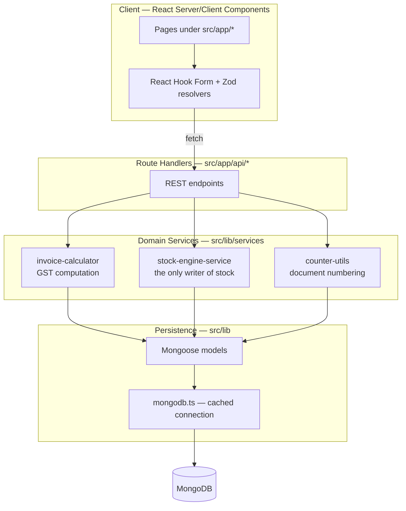

# Invoice & Inventory Management System

A GST-compliant billing and stock management application for Indian businesses. Handles sales
invoicing, purchase bills, multi-godown inventory, credit/debit notes, and a full immutable stock
ledger.

Built with Next.js 16 (App Router), MongoDB via Mongoose, and TypeScript.

---

## Table of Contents

- [Quick Start](#quick-start)
- [Tech Stack](#tech-stack)
- [Architecture](#architecture)
- [Directory Layout](#directory-layout)
- [Data Model](#data-model)
- [Core Business Flows](#core-business-flows)
- [The Stock Engine](#the-stock-engine)
- [The GST Tax Engine](#the-gst-tax-engine)
- [Document Numbering](#document-numbering)
- [API Reference](#api-reference)
- [Application Routes](#application-routes)
- [Validation](#validation)
- [Known Issues & Gotchas](#known-issues--gotchas)

---

## Quick Start

**Prerequisites:** Node.js 20+, a running MongoDB instance (local or Atlas).

```bash
npm install
```

Create `.env.local` from the template:

```bash
cp .env.example .env.local
```

| Variable | Purpose | Default |
|---|---|---|
| `MONGODB_URI` | MongoDB connection string | `mongodb://localhost:27017/invoice-db` |
| `NEXT_PUBLIC_APP_URL` | Public base URL (client-visible) | `http://localhost:3000` |

Then:

```bash
npm run dev
```

Open <http://localhost:3000> — it redirects to `/inventory`.

No seed step is required. On the first call to `GET /api/company`, a default company profile is
created automatically so the tax engine has a home state to compare against. Edit it under
**Settings** before issuing real documents.

### Scripts

| Command | What it does |
|---|---|
| `npm run dev` | Development server (Turbopack) |
| `npm run build` | Production build — compiles, then type-checks |
| `npm start` | Serve the production build |
| `npm run lint` | ESLint across the project |
| `npm run type-check` | `tsc --noEmit` with a raised heap limit |

> Both `build` and `type-check` run under `--max-old-space-size=4096`. This is deliberate — see
> [Known Issues](#known-issues--gotchas).

---

## Tech Stack

| Layer | Choice |
|---|---|
| Framework | Next.js 16.2 (App Router, Turbopack) |
| UI | React 19, Tailwind CSS 4, Radix UI primitives |
| Forms | React Hook Form + Zod (via `@hookform/resolvers`) |
| Database | MongoDB + Mongoose 9 |
| Validation | Zod 3 |
| Charts | Recharts |
| PDF export | jsPDF + html2canvas |
| Notifications | react-hot-toast |
| Icons | lucide-react |

---

## Architecture

A four-layer server design. Every write that touches stock is funnelled through a single service so
the ledger can never drift from item balances.



**Design rules the codebase follows:**

1. **Route handlers are thin.** They parse the request, call a domain service, and shape the
   response. Business arithmetic lives in `src/lib/services`.
2. **`processStockMovement` is the single choke point for stock.** No route mutates `item.stock`
   directly. Every movement simultaneously updates the item balance and appends a ledger row.
3. **The stock ledger is append-only during normal operation.** Rows are deleted only by an explicit
   cancellation via `revertStockMovement`.
4. **The connection is cached on `globalThis`.** `src/lib/mongodb.ts` memoises the Mongoose
   connection so Next.js hot reloads and serverless invocations reuse one pool instead of leaking
   connections.

---

## Directory Layout

```
src/
├── app/
│   ├── api/                     # Route handlers (the REST surface)
│   │   ├── invoices/            # Sales invoices  (GET, POST, [id]: GET/PUT/DELETE)
│   │   ├── purchases/           # Purchase bills  (GET, POST, [id]: GET/DELETE)
│   │   ├── items/               # Item master     (GET, POST, [id]: GET/PUT/DELETE)
│   │   ├── parties/             # Customers & suppliers
│   │   ├── credit-notes/        # Sales returns
│   │   ├── debit-notes/         # Purchase returns
│   │   ├── stock-adjustments/   # Manual stock in/out
│   │   ├── stock-transfers/     # Godown-to-godown movement
│   │   ├── inventory/
│   │   │   ├── summary/         # Valuation + low-stock rollup
│   │   │   └── ledger/          # Filterable stock ledger
│   │   ├── transactions/        # Unified cross-document feed
│   │   ├── company/             # Company profile (self-seeding)
│   │   ├── godowns/             # Warehouse master
│   │   └── batches/             # Batch master
│   │
│   ├── layout.tsx               # Shell: sidebar + headers + toaster
│   ├── page.tsx                 # Redirects to /inventory
│   └── <feature>/page.tsx       # Feature screens
│
├── components/layout/
│   ├── desktop/                 # DesktopSidebar, DesktopHeader
│   └── mobile/                  # MobileHeader
│
├── lib/
│   ├── models/index.ts          # All Mongoose schemas + models
│   ├── mongodb.ts               # Cached connection helper
│   ├── services/
│   │   ├── invoice-calculator.ts    # GST math (pure, no I/O)
│   │   └── stock-engine-service.ts  # Stock mutation + ledger
│   ├── schemas/                 # Zod validation schemas
│   ├── types/                   # Shared TypeScript interfaces
│   ├── utils/counter-utils.ts   # Atomic document numbering
│   └── constants/index.ts       # Indian states, GST rates, units
│
└── common/regex.ts              # GSTIN, PAN, pincode, phone, HSN patterns
```

---

## Data Model

All models are defined in [`src/lib/models/index.ts`](src/lib/models/index.ts) and created through a
`getOrCreateModel` helper that guards against Next.js hot-reload model redefinition.

| Model | Collection role | Notes |
|---|---|---|
| `ItemModel` | Item master | `type: Product \| Service` — only Products carry stock |
| `StockLedgerModel` | Immutable movement log | The audit source of truth |
| `InvoiceModel` | Sales invoices | Decrements stock |
| `PurchaseInvoiceModel` | Purchase bills | Increments stock |
| `CreditNoteModel` | Sales returns | Increments stock (goods come back) |
| `DebitNoteModel` | Purchase returns | Decrements stock (goods go back) |
| `StockAdjustmentModel` | Manual corrections | Direction set by `type` |
| `StockTransferModel` | Godown transfers | Writes *two* ledger rows, net zero |
| `PartyModel` | Customers & suppliers | `partyType` discriminates |
| `CompanyModel` | Own company profile | Supplies the home state for GST |
| `CounterModel` | Sequence generator | One document per series |
| `GodownModel`, `BatchModel`, `TransporterModel` | Masters | |
| `JournalModel`, `PaymentModel`, `ReceiptModel`, `DeliveryChallanModel` | Accounting scaffolding | Schemas exist; UI not yet built |

### The stock ledger row

Every movement appends one row. `balanceStock` is the item balance *after* the movement, which makes
the ledger independently replayable.

| Field | Meaning |
|---|---|
| `date` | Movement date (`Date`) |
| `itemId` / `itemName` | Item reference and denormalised name |
| `transactionType` | Which document class caused it |
| `referenceId` | The document number — the key used to revert |
| `qtyIn` / `qtyOut` | Movement in the item's base unit |
| `balanceStock` | Running balance after this row |
| `godown`, `batch`, `rate`, `narration` | Context |

---

## Core Business Flows

### Sales invoice — `POST /api/invoices`

```mermaid
sequenceDiagram
    participant UI as /sales/new
    participant API as POST /api/invoices
    participant Cnt as counter-utils
    participant Calc as invoice-calculator
    participant Eng as stock-engine
    participant DB as MongoDB

    UI->>API: invoice payload
    API->>Cnt: getNextCounterValue("sales-invoice","INV")
    Note over API,Cnt: skipped if client supplied a number
    Cnt-->>API: INV-001
    API->>DB: load company profile (home state)
    API->>Calc: calculateInvoiceTaxes(items, partyState, companyState)
    Calc-->>API: per-line tax split + totals + roundOff
    API->>DB: create Invoice
    loop each Product line
        API->>Eng: processStockMovement(qtyOut = line qty)
        Eng->>DB: item.stock -= qty; recompute isLowStock
        Eng->>DB: append StockLedger row
    end
    API-->>UI: 201 Created
```

Service lines are skipped by the stock loop — they have no inventory.

### Purchase bill — `POST /api/purchases`

Mirror image of the sales flow: numbered `PUR-nnn`, and each Product line calls
`processStockMovement` with `qtyIn` set, raising stock.

### Stock adjustment — `POST /api/stock-adjustments`

Numbered `ADJ-nnn`. The payload's `type` field selects the direction:

| `type` | Ledger `transactionType` | Effect |
|---|---|---|
| `Stock In` | `Stock In Adjustment` | `qtyIn` |
| anything else | `Stock Out Adjustment` | `qtyOut` |

### Godown transfer — `POST /api/stock-transfers`

Numbered `TRN-nnn`. Writes **two** ledger rows per item — a `Godown Transfer Out` against the source
godown and a `Godown Transfer In` against the destination. Net effect on total stock is zero; the
rows exist so per-godown history stays auditable.

### Credit & debit notes

| Document | Meaning | Stock effect |
|---|---|---|
| Credit note (`CN-nnn`) | Sales return — customer sends goods back | `qtyIn` |
| Debit note (`DN-nnn`) | Purchase return — you send goods back | `qtyOut` |

### Cancellation & stock reversal

`DELETE /api/invoices/[id]` and `DELETE /api/purchases/[id]` do **not** delete the document. They:

1. Set `status = "Cancelled"` and save.
2. Call `revertStockMovement(documentNumber, transactionType)`.

`revertStockMovement` finds every ledger row for that reference, applies the inverse delta
(`qtyOut - qtyIn`) to each item, recomputes `isLowStock`, and then deletes those ledger rows. The
document survives as a cancelled record; the stock effect is undone.

> `DELETE /api/items/[id]` is a genuine hard delete and does **not** revert ledger history.

### Reporting

- **`GET /api/inventory/summary`** — iterates Products to produce item count, low-stock count, total
  quantity, and valuation at both cost and selling price. Cost falls back to selling rate when
  `purchaseRate` is unset.
- **`GET /api/transactions`** — fans out across six collections in parallel (`Promise.all`) and
  normalises them into one chronological feed of
  `{ type, voucherNo, date, partyName, amount, status }`.
- **`GET /api/inventory/ledger`** — the raw ledger, filterable by `itemId` and `transactionType`.

---

## The Stock Engine

[`src/lib/services/stock-engine-service.ts`](src/lib/services/stock-engine-service.ts) exposes two
functions and is the only module permitted to change stock.

```ts
processStockMovement(movement: StockMovementInput): Promise<number>  // returns new balance
revertStockMovement(referenceId, transactionType): Promise<void>
```

`processStockMovement`:

1. Loads the item; throws if missing.
2. Returns `0` immediately for `Service` items.
3. Computes `newBalance = currentStock + qtyIn - qtyOut`.
4. Writes `item.stock` and recomputes `item.isLowStock` (`minStock > 0 && balance <= minStock`).
5. Appends the ledger row carrying that `newBalance`.

Because the balance and the ledger row are written from one function, they cannot disagree — provided
nothing bypasses the service.

---

## The GST Tax Engine

[`src/lib/services/invoice-calculator.ts`](src/lib/services/invoice-calculator.ts) is a pure
function — no database access, no side effects, trivially testable.

```ts
calculateInvoiceTaxes(items, partyState, companyState): CalculationResult
```

**Intra-state vs inter-state.** The party's state is compared to the company's home state
(case-insensitive, trimmed):

| Comparison | Tax split |
|---|---|
| Same state | CGST = rate ÷ 2, SGST = rate ÷ 2, IGST = 0 |
| Different state | IGST = full rate, CGST = SGST = 0 |

**Inclusive vs exclusive pricing.** Per line item:

```
gross      = qty × rate
discount   = gross × discountPercent / 100
net        = gross − discount

taxable    = net / (1 + taxRate/100)     when taxType = "Inclusive"
taxable    = net                          when taxType = "Exclusive"
```

**Rounding.** Line values are rounded to 2 decimals. The grand total is rounded to the nearest whole
rupee, and the difference is returned as `roundOff` so the invoice reconciles exactly.

Supported GST rates are constrained by `VALID_GST_RATES` in `src/lib/constants`:
`0, 0.1, 0.25, 1, 1.5, 3, 5, 6, 7.5, 12, 18, 28, 40`.

---

## Document Numbering

[`src/lib/utils/counter-utils.ts`](src/lib/utils/counter-utils.ts):

```ts
getNextCounterValue(counterName: string, prefix = ""): Promise<string>
```

Uses a single atomic `findOneAndUpdate` with `$inc` and `upsert: true`, so concurrent requests cannot
collide on a number. Returns `PREFIX-001` (3-digit zero padding), or the bare padded number when no
prefix is given.

| Series | Counter name | Format |
|---|---|---|
| Sales invoice | `sales-invoice` | `INV-001` |
| Purchase bill | `purchase-invoice` | `PUR-001` |
| Stock adjustment | `stock-adjustment` | `ADJ-001` |
| Godown transfer | `stock-transfer` | `TRN-001` |
| Credit note | `credit-note` | `CN-001` |
| Debit note | `debit-note` | `DN-001` |

Every route checks for a client-supplied number first and only draws from the counter when none was
provided — so manual numbering never burns a sequence value.

---

## API Reference

All endpoints return JSON. Errors respond `{ error: string }` with status `500`, or `404` where the
resource is addressed by id.

| Endpoint | Methods | Purpose |
|---|---|---|
| `/api/invoices` | `GET`, `POST` | List / create sales invoices |
| `/api/invoices/[id]` | `GET`, `PUT`, `DELETE` | Fetch, update, cancel+revert |
| `/api/purchases` | `GET`, `POST` | List / create purchase bills |
| `/api/purchases/[id]` | `GET`, `DELETE` | Fetch, cancel+revert |
| `/api/items` | `GET`, `POST` | Item master |
| `/api/items/[id]` | `GET`, `PUT`, `DELETE` | Item detail (hard delete) |
| `/api/parties` | `GET`, `POST` | Customers & suppliers |
| `/api/parties/[id]` | `PUT`, `DELETE` | Party detail |
| `/api/credit-notes` | `GET`, `POST` | Sales returns |
| `/api/debit-notes` | `GET`, `POST` | Purchase returns |
| `/api/stock-adjustments` | `GET`, `POST` | Manual stock in/out |
| `/api/stock-transfers` | `GET`, `POST` | Godown transfers |
| `/api/inventory/summary` | `GET` | Valuation & low-stock rollup |
| `/api/inventory/ledger` | `GET` | Ledger; `?itemId=&transactionType=` |
| `/api/transactions` | `GET` | Unified transaction feed |
| `/api/company` | `GET`, `POST` | Company profile (self-seeds on first GET) |
| `/api/godowns` | `GET`, `POST` | Warehouse master |
| `/api/batches` | `GET`, `POST` | Batch master |

---

## Application Routes

Navigation is defined in
[`src/components/layout/desktop/DesktopSidebar.tsx`](src/components/layout/desktop/DesktopSidebar.tsx).

| Route | Screen |
|---|---|
| `/` | Redirects to `/inventory` |
| `/sales` · `/sales/new` | Sales invoice list · creation form |
| `/purchases` · `/purchases/new` | Purchase bill list · creation form |
| `/inventory` | Item master |
| `/inventory/[id]/ledger` | Per-item stock ledger |
| `/inventory/adjustments` | Stock adjustments |
| `/inventory/transfers` | Godown transfers |
| `/credit-notes` · `/debit-notes` | Returns |
| `/dashboard` | KPI overview |
| `/transactions` | Unified transaction feed |
| `/settings` | Company profile |

The root layout renders a fixed desktop sidebar (`lg:pl-[260px]`), a desktop header, a mobile header,
and a global toaster.

---

## Validation

Two independent layers:

1. **Client — Zod schemas** in `src/lib/schemas/` (`gst-schemas`, `inventory-schemas`,
   `invoice-schemas`, `purchase-schemas`), wired into React Hook Form via `@hookform/resolvers`.
   Format rules come from `src/common/regex.ts`:

   | Pattern | Rule |
   |---|---|
   | `GSTIN_REGEX` | 15-character GSTIN |
   | `PAN_REGEX` | 10-character PAN |
   | `PINCODE_REGEX` | 6 digits |
   | `PHONE_REGEX` | 10 digits starting 6–9 |
   | `HSN_SAC_REGEX` | 4, 6, or 8 digits |
   | `VEHICLE_NO_REGEX` | Indian vehicle registration |

2. **Database — Mongoose schema validation**: `required`, `enum`, `unique`, and type coercion.

> Route handlers currently trust the request body and spread it into `Model.create({ ...body })`.
> The Zod schemas are not re-applied server-side. See below.

---

## Known Issues & Gotchas

Things a new contributor will hit. All are live in the codebase today.

### Route handlers do not re-validate input

Every write route spreads the raw request body into `Model.create({ ...body })`. Mongoose's own
`required`/`enum` rules are the only server-side gate — the Zod schemas run in the browser only.
Anyone calling the API directly bypasses them. Applying the existing schemas inside the route
handlers would close this without new code.

### The TypeScript checker needs a raised heap

`build` and `type-check` both set `--max-old-space-size=4096`. Without it the checker exhausts its
heap. The trigger was the **generic** overload `mongoose.model<T>(name, schema)` on Mongoose 9 + TS 5;
[`src/lib/models/index.ts`](src/lib/models/index.ts) deliberately uses the non-generic overload with a
cast instead. That is runtime-identical — the generic is type-only. **Do not "tidy" it back.**

### `StockLedgerEntry` describes the wire shape, not the stored shape

`StockLedgerSchema` stores `date` as a `Date` and `itemId` as an `ObjectId`. The shared
`StockLedgerEntry` interface declares both as `string`, which is correct for the client (JSON
serialises them that way) but wrong for the document. The model is therefore typed with a separate
`StockLedgerDoc`. If server-side code consumes `StockLedgerEntry` and treats `date` as a string, that
is a bug.

### `src/lib/models.ts` shadows `src/lib/models/index.ts`

`models.ts` is a one-line `export * from "./models/index"`. Under `moduleResolution: "bundler"` the
file wins over the directory, so `@/lib/models` resolves through the re-export. Harmless, but
confusing — worth collapsing.

### Sales lines match stock items by name

`POST /api/invoices` resolves each line to an item with `ItemModel.findOne({ name: item.name })`.
Renaming an item, or two items sharing a name, will silently mis-post stock. Purchases and
adjustments correctly use `findById`.

### Cancellation is not atomic

`revertStockMovement` loops items and then deletes ledger rows without a transaction. A failure
mid-loop leaves stock partially reverted. A MongoDB session/transaction would make this safe.

### Errors are surfaced but not logged

Client-side `catch { }` blocks raise a toast and discard the error object, so failures leave no
console trace. Route handlers return `error.message` directly to the client, which can leak internal
detail.

### Unbuilt scaffolding

`JournalModel`, `PaymentModel`, `ReceiptModel`, and `DeliveryChallanModel` have schemas but no API
routes or screens.
